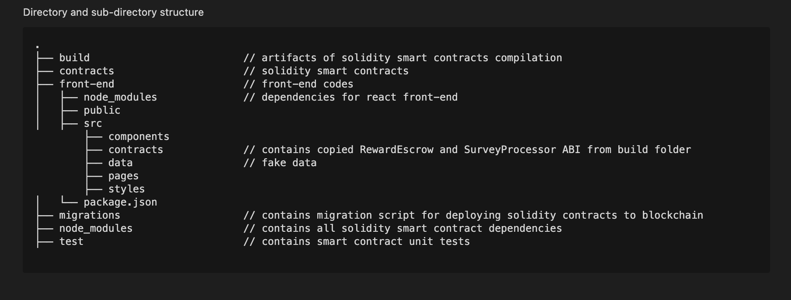

# blockchain-developer-bootcamp-final-project

## Directory Structure


## How to run this project locally:

### Prerequisites

- Node.js >= v14
- Truffle and Ganache
- NPM or YARN


### Local Environment Setup
1. `git  clone `

2. `git checkout main`

3. Install Dependencies

    - Solidity Smart Contract 
    ```
        $ npm install
    ```
    
    - React Front-end 
    
    ```
        $ cd front-end
        $ npm install
    ```

4. Deploy Smart Contracts locally

    ```
        Start Ganache and Configure port "7545" in Ganache for local test nest

        $ cd blockchain-developer-bootcamp-final-project
        $ truffle migrate --reset --compile-all
    ```
        
5. Copy *Survey Processor* and *Reward Escrow* smart contract ABIs from ./build folder to ./front-end/src/contracts

6. Populate .env file

    ```
        $ cd front-end
        % vi .env
    ```

    - Register and create API access key from NFT.STORAGE https://nft.storage/#getting-started and assign the key to REACT_APP_NFT_STORAGE_API_KEY  

    - Refer to Survey Processor contract deployed, assign the contract address to REACT_APP_SURVEY_PROCESSOR_CONTRACT  

    - Refer to Reward Escrow contract deployed, assign the contract address to REACT_APP_REWARD_ESCROW_CONTRACT  


7. Start UI locally

    ```
        $ cd front-end
        $ npm start
        
        Open `http://localhost:3000`
    ```


> You will encounter below ERROR when running front-end code. It's due to nft.storage service the project depends on.

<mark style="background-color: lightblue">Failed to compile</mark>
```
./node_modules/nft.storage/src/platform.web.js
Module not found: Can't resolve 'ipfs-car/blockstore/memory' in '/Users/shelly/Documents/BlkC/consensys/blockchain-developer-bootcamp-final-project/front-end/node_modules/nft.storage/src'
```

Resolution:

    1. Go to front-end/node_modules/nft.storage directory.

    2. Make sure you have ipfs-car/dist/esm/blockstore and ipfs-car/dist/esm/pack. If not, install ipfs-car with yarn add ipfs-car. 

    3. Copy ipfs-car/dist/esm to nft.storage/src.

    4. Inside nft.storage/src, update the ipfs-car import statements in the following files like so:

        * Inside platform.web.js, update to this: import { MemoryBlockStore } from 'ipfs-car/dist/esm/blockstore/memory'
        * Inside lib.js, update to this: import { pack } from 'ipfs-car/dist/esm/pack'
        * Inside token.js, update to this: import { pack } from 'ipfs-car/dist/esm/pack'
        

    5. Run `npm start`, it should be working fine now.

Ref: https://stackoverflow.com/questions/70063600/cant-resolve-ipfs-car-blockstore-memory-when-importing-nft-storage


### Running Solidity Unit Tests

    ```
        Start Ganache and Configure port "7545" in Ganache for local test nest

        $ cd blockchain-developer-bootcamp-final-project
        $ truffle test
    ```


### Deploying smart contract to test network

## Screencast link


## Project description

Take surveys and earn ETH.

## Workflow Implemented

Survey Owner
1. Enter web site
2. Login with Metamask
3. Create a set of Survey Questions
5. Agree on survey owner address (used for excess ETH withdrawal), specify amount to reward for each response and total amount of ETH for survey locked in escrow contract (smart contract call)
6. Interact with Survey Processor Contract to register survey to survey owner address
7. Intearct with Survey Processor Contract to withdraw excess ETH deposited in Reward Escrow Contract

Survey Respondent
1. Enter web site
2. Login with Metamask
3. Browse surveys
4. Select survey and answer
5. Survey response and its metadata is uploade to IPFS
6. Interact with Survey Processor Contract to save the location of survey response metadata

## Improvements under consideration for next iteration 
1. Storing survey responses privately, either stored them off-chain or add encryption to content uploaded to ipfs
2. Survey taker takes survey without knowing that there are no more rewards to earn. (reward per response * num survey takers > total rewards in escrow contract). This wastes survey taker's time, with no return on the time invested.
3. Extracting survey responses of the survey and make it downloadable as a collection of responses
4. Reard Escrow contract only allowing calls from Survey Processor contract
5. Survey taker cannot respond to the same survey
6. Survey taker redeem accumulated rewards

